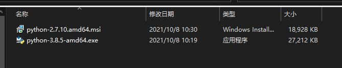
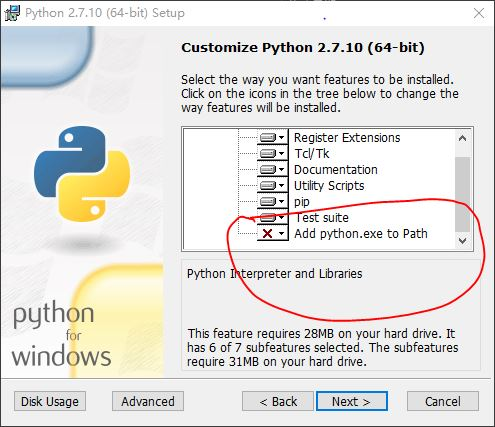
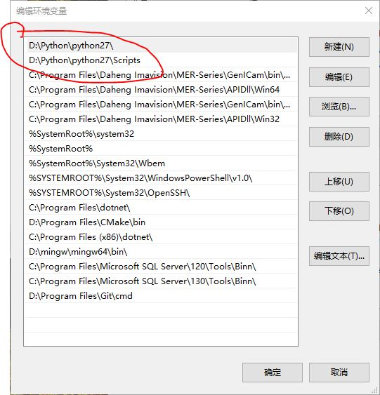
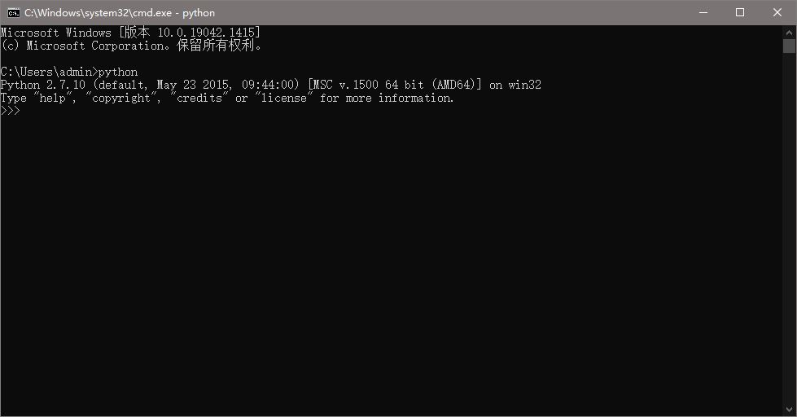
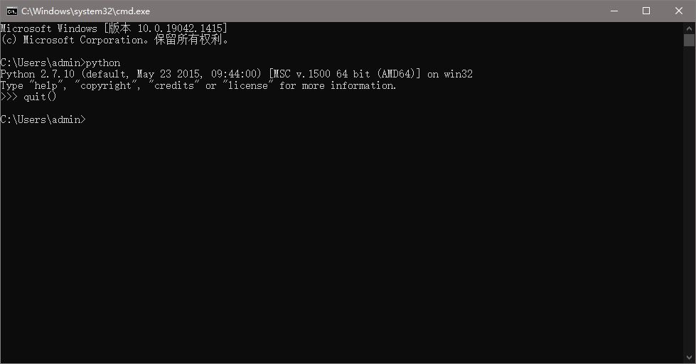
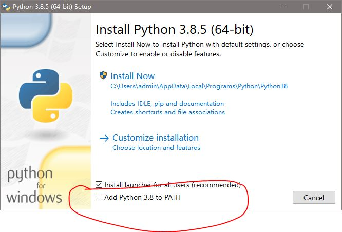
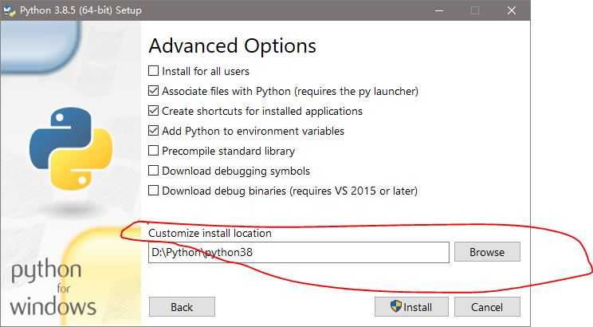

### Python ENV

#### 在计算机上安装Python

1. 首先我们从官网下载两个版本Python

   

2. 安装

   - 安装python2.7.10

     这儿选择将exe添加到环境变量

     

     

     

     安装完发现系统环境变量中有了2.7.10的环境变量

     

     现在我们从命令行进入刚才安装的python环境：

     

     这个就是我们刚刚安装的python2.7.10的环境。

     退出环境输入:quit()

     

     

   - 安装python3.8.5

     这儿和上面一样，选择添加到环境变量，并选择第二个 **Customize installation**

     

     然后点next，一直到选择安装位置，我选的是下面的路径：

     

     

     点击Install

     不过这儿安装完貌似没有将python3.8这个添加到系统的环境变量中，没关系，我们手动添加：

     下面是Python3.8的安装路径：

     

     添加环境变量：

     

     这时候我们电脑就安装了两个版本的python

     现在我们在命令行再进入python环境：

     

     发现还是2.7的版本，那么可以通过在系统环境变量中将你需要用的那个python版本的环境变量移动到最上面就行，系统就会找第一个环境变量:

     

     需要哪个就点击它，然后点右边的**上移**。

     重启电脑后再进去系统的python环境：

     

     这时候就切换到3.8的环境了。

     

     以上是从官网下载python并安装到我们电脑，让我们电脑具有python的环境，并且说明了当有多个版本的时候怎么切换python版本。

     
     

#### 使用系统的python环境

1. 刚才我们安装的就是一个环境，只不过是系统的环境。有2.7和3.8两个版本的环境

2. 我们看看这两个环境中已经有的包：由于不想重启，我们就看python3.8的，输入命令: **pip list**

   

   这个pip是python3.8的pip，这时候的系统环境中的python已经是3.8了，和2.7没关系了，所以现在看到的是3.8中已经安装的包。

3. 来安装个包试试 ：

   

4. 现在再来看已经安装的包（pip3是python3特有的，pip3 install pillow: 安装最新版，如果要指定版本： **pip3 install pillow==2.2.2**）

   

5. 上面的过程我们一直使用的是系统安装的python环境，下面我们在pycharm中使用该环境。

   -  在一个文件夹下创建一个py文件，用pycharm将其作为一个project打开。

     

     

   - 为这个项目配置系统的python3.8环境

     

     发现已有的包就是我们刚才在控制台看到的那三个。

   - 我们在项目下的py文件中使用该库，看在不在

     

     那么到此就成功应用到了系统的python库。

     **但是如果我们有2个及以上的项目，但是他们用到的库不同，这时候我们就需要为不同的项目配置各自的环境，而不是所有的库都装在系统原有的Python环境中**

   - ......

6. 2


#### 利用已经安装好的系统的Python3.8新建一个虚拟的python环境

1. 刚才我们的打开的**testpro**在这个位置：

   

   

2. 用命令行进入到该文件夹下，并新建一个文件夹**virtual_env**用来保存我们要创建的虚拟环境

   

3. 用命令

   ```
   pip3 install virtualenv
   ```

   用系统的python3.8安装**virtualenv**包

   

   

4. 进入virtual_env这个文件夹，并用这个包新建一个虚拟环境，环境名叫：my_env

   ```
   virtualenv my_env
   ```

   

   

   

   这时候一个虚拟环境就创建好了。

5. 进入到my_env/Scripts目录激活环境: **activate.bat**

   

   现在我们就是在新建的虚拟环境中，这个环境和系统的环境没关系了。但是python的版本还是系统的那个版本：3.8

6. 我们看看这个虚拟环境中的库

   

   显然，是个全新的库，并没有系统中刚才安装的pillow包。

7. 在这个环境中安装个包试试

   

   

8. 将刚才的项目testpro使用该虚拟环境，在Add Python Interpreter对话框中选择虚拟环境而不是系统环境了，并且这个环境是我们刚才已经创建好了，所以选择现有的环境，这时候项目testpro就使用的是环境my_env了。并且也有刚才按安装的requests包。

    d

   

   

9. 在该环境下测试下代码

   

   这一部分就是我们利用系统的Python环境，给我们的项目单独弄一个环境，避免了不管什么项目都用系统环境的情况，毕竟那样会显得很乱。

10. d

#### Anaconda创建python环境

1. 首先安装好Anaconda，我这里直接下载的最新版，你下载的Anaconda其实和我们安装python差不多，它是自带一个python版本的，也就是说你下载一个Anaconda，它是自己原本就包含一个版本的python。安装的时候不要选择将其添加到系统环境变量中，因为这样可能影响到你现有项目。但是如果我们现在就像把Anaconda带的那个版本的python作为系统默认的Python环境的话也很简单，就是将其安装目录下的python.exe所在文件夹和Scripts加入到系统环境变量，并移动到前面装的3.8和2.7前面就行，然后重启。

   

   

   

   

2. 重启后再看看python的版本

   

   这时候就是Anaconda所带的python的环境了。

3. 我们将testpro的环境就换成该环境，就在解释器那选择Anaconda安装路径下的python.exe即可。

   

   

   

4. 然后下面就是Anaconda自己已经安装好的库

   

   

5. 3

#### Anaconda也有和virtualenv这个库相似的操作，也可以单独创建新的环境

1. 在开始菜单的Anaconda3下找到**Anaconda Prompt**，打开

   

   

   base表示就是在Anaconda自带的python环境下，版本和前面看到的是一样的。

2. 现在来建新的环境，并指定python版本

   

   

   done表示已经安装完成

3. 来看看刚才新建的环境放在 哪了

   

4. 激活环境

   

   该环境被激活，可以看到python的版本变了。

5. 新的环境和Anaconda安装目录下的其实是差不多的，可以用同样的方法为testpro配置该环境，这里就不写了。

   

6. d

7. e


#### 小结

以上所有的方法所创建的环境都是彼此独立的，所以要在你用的那个环境中安装相关包。Anaconda好处就是它可以把一个包依赖的其他包都一次装上。


#### 附1-Anaconda常用命令

- **查看当前存在的环境**

  ```
  conda env list
  ```

- **列出环境中已经安装的库**

  ```
  conda list
  ```

- **创建环境**

  ```
  conda create -n 环境名 python=Python版本
  如：conda create -n my_env python=3.6
  ```

- **安装库**

  ```
  conda install 库名
  pip install 库名
  ```

- **激活环境**

  ```
  activate 环境名
  ```

- **删除环境**

  ```
  conda remove -n 环境名 --all
  ```

- **退出环境**

  ```
  deactivate 环境名
  ```

- **删除库**

  ```
  conda remove 库名
  ```

- **新建环境时同时安装一个包**

  ```
  conda create -n 环境名 python=Python版本 库名
  如：conda create -n my_env python=3.6 tensorflow
  ```

#### r


